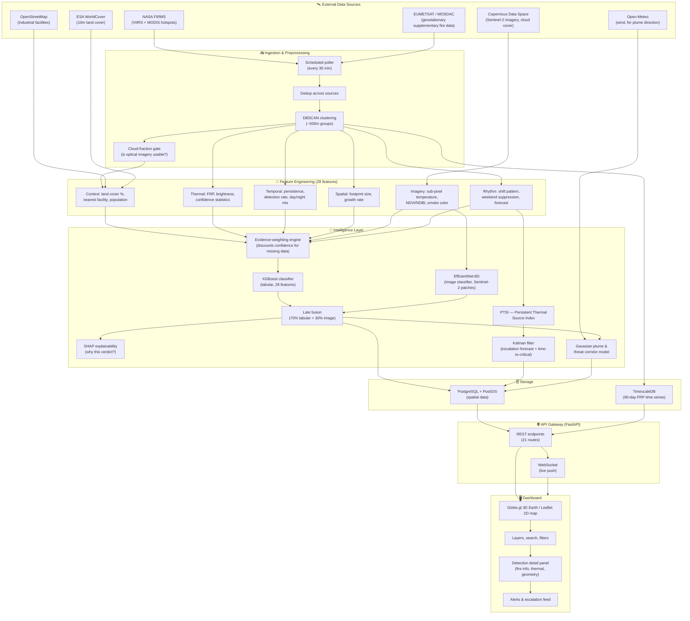

# FireSight — AI-Based Industrial Fire & Thermal Anomaly Classification Platform

**Smart India Hackathon 2026 — Problem Statement PS162, set by NTRO**

This document explains the entire project in plain language: what problem it solves, how it's built, what data it uses, and how all the pieces fit together. It's written for anyone joining the project cold — a teammate, a judge, or future-you six months from now.

---

## 1. The Problem, In Plain Words

NASA runs a free satellite service called **FIRMS** (Fire Information for Resource Management System). Every day, satellites orbiting the Earth detect spots that are unusually hot — a "thermal anomaly" — and FIRMS publishes their location, temperature, and a rough confidence score.

The catch: **FIRMS cannot tell you *what* is burning.** A hotspot could be:

- A **wildfire** genuinely burning through a forest
- A farmer **burning crop stubble** after harvest (extremely common in Punjab/Haryana)
- A **gas flare** at a refinery — a controlled, continuous flame that's supposed to be there
- An **accidental industrial fire** — an explosion, a leak that ignited, a runaway process
- Heat from **mining activity** — coal seam fires, processing heat

To a satellite, all five look almost identical: "something here is hot." The Forest Survey of India already has to manually filter out industrial/mining false alarms from its wildfire alerts — proof this is a real, unsolved problem, not a hypothetical one.

**What this project does:** it takes that raw, undifferentiated stream of hotspots and answers three questions automatically:

1. **What kind of thermal event is this?** (the 5-way classification above)
2. **Is this normal or abnormal for this specific location?** (a refinery flare burning today is normal; the same refinery suddenly running 4x hotter than its usual pattern is not)
3. **Where is it, what's nearby, and is it getting worse?** (shown on a live map, with a forecast of whether it's escalating)

---

## 2. The Core Idea, In One Sentence

> FIRMS says *"something hot is here"* → land cover + facility records + weather say *"here's the context"* → machine learning says *"here's what it probably is"* → a time-series anomaly layer says *"here's whether this is normal behaviour for this spot"* → a map shows all of it live.

That last step — normal-vs-abnormal behavior over time — is the part that goes beyond what the official problem statement strictly asks for, and it's the project's main differentiator. A basic version of this project would just classify each hotspot once and stop. This one also watches each location over time and flags when something changes.

---

## 3. Architecture Diagram



### What each layer is actually doing

| Layer | Plain-language job |
|---|---|
| **External Data Sources** | Where the raw information comes from — satellites, maps, weather |
| **Ingestion & Preprocessing** | Pulls the data in, removes duplicates, groups nearby detections into one "event," and checks whether it's cloudy enough to skip camera-based analysis |
| **Feature Engineering** | Turns raw numbers into meaningful signals — "is this near a refinery," "has this spot been hot for 40 days," "does the smoke look grey or black" |
| **Intelligence Layer** | The actual decision-making: two machine learning models vote on what the fire is, a separate system tracks whether a location's behavior is unusual, and a forecast estimates if things are getting worse |
| **Storage** | A database built for both maps (PostGIS) and time-series data (TimescaleDB) |
| **API Gateway** | The single door everything talks through — one web server serving both data and the live dashboard |
| **Dashboard** | What a human actually sees: a rotating 3D Earth with fire markers, click-to-inspect detail, filters, search, and alerts |

---

## 4. What the System Actually Detects

Five categories, matching the official problem statement's ask to separate industrial fires from natural ones:

| Class | What it looks like | Real-world example |
|---|---|---|
| **Industrial Fire** | Sudden, abnormal, uncontrolled heat at a known facility | Refinery explosion, chemical plant fire |
| **Gas Flare** | Controlled, continuous, expected heat at a fixed point | Routine flaring at an oil/gas facility |
| **Wildfire** | Spreading, growing footprint, typically in forest land cover | A forest fire expanding over days |
| **Agricultural Burning** | Short-lived, seasonal, on cropland | Stubble burning after harvest in Punjab/Haryana |
| **Mining Anomaly** | Persistent heat near a mapped mine/coalfield | Coal seam fire, processing heat |

On top of the classification, every detection also gets a **Persistent Thermal Source Index (PTSI)** — a running score of "how normal is this for this exact spot, historically" — and a **Kalman-filter-based forecast** estimating whether the heat output is trending toward a dangerous threshold, with an honest confidence interval rather than a single guess.

---

## 5. How a Detection Flows Through the System (Step by Step)

1. **A satellite sees a hot pixel.** NASA FIRMS reports it (usually within a few hours).
2. **The system fetches it** on its next 30-minute poll, along with any other sources currently configured (Sentinel-3, Himawari, or a geostationary backup).
3. **Duplicates get merged.** The same fire seen by two different satellites shouldn't count as two events.
4. **Nearby detections get grouped.** A cluster of hot pixels 500m apart is treated as one event, not ten.
5. **The system checks the weather.** If it's too cloudy for a satellite camera to see through, it skips the imagery step rather than guessing.
6. **Context gets attached.** What's the land cover here? Is there a known industrial facility nearby? How many people live in the area?
7. **28 numeric features get assembled** — thermal statistics, how long this spot has been hot, how fast it's spreading, what the imagery shows, and whether it fits a "shift-work" pattern (heat that always appears in the same 8-hour window looks industrial; heat with no schedule doesn't).
8. **Two machine learning models vote.** One looks at the 28 numbers (XGBoost); one looks at an actual satellite photo of the spot if available (a fine-tuned image classifier). Their votes are combined, weighted 70/30 toward the numbers model since it's available more often.
9. **The verdict gets explained**, not just stated — the system can show *which* features drove the decision (e.g., "classified as gas flare mainly because of its 45-day persistence and proximity to a known facility").
10. **If it's industrial, downstream physics kicks in** — which direction would smoke travel, which populated areas would be affected, is this facility's heat output escalating.
11. **Everything lands on a live 3D map** with search, filters, and a detail panel a responder can actually use.

---

## 6. Technology Stack

### Backend
| Component | Technology |
|---|---|
| Language | Python 3.11+ |
| Web framework / API | **FastAPI** (with WebSocket support for live updates) |
| Task queue | **Celery** + **Redis** (each detection triggers a chain of background jobs) |
| Database | **PostgreSQL** with **PostGIS** (spatial queries) and **TimescaleDB** (time-series FRP data) |
| ORM / migrations | SQLAlchemy + Alembic |
| Scheduling | APScheduler (the 30-minute polling loop) |

### Machine Learning / Data Science
| Component | Technology |
|---|---|
| Tabular classifier | **XGBoost** (gradient-boosted trees, 28-feature input, 5-class output) |
| Hyperparameter tuning | Optuna |
| Explainability | **SHAP** (explains individual predictions) |
| Image classifier | **EfficientNet-B0** (PyTorch), adapted to accept 6-band satellite imagery instead of the usual 3-band RGB |
| Numeric / scientific computing | NumPy, SciPy, Pandas, scikit-learn |
| Geospatial math | Shapely, GeoAlchemy2 |
| Raster/satellite imagery | **Rasterio** (reads Cloud-Optimized GeoTIFFs directly from cloud storage) |

### Frontend
| Component | Technology |
|---|---|
| 3D globe | **Globe.gl 2.46** over three-globe/WebGL — NASA Blue Marble imagery with a topology bump map, used for the approach view |
| 2D map | **Leaflet 1.9** — the operational view; the globe hands over to it automatically below ~0.35 Earth-radii altitude |
| Base imagery | ESRI World Imagery + World Boundaries and Places |
| Everything else | Vanilla HTML/CSS/JavaScript (no framework) — search, class/sensor/confidence/FRP/state filters, the event detail panel with SHAP reasoning, a plain-text incident report, and live WebSocket updates |

The dashboard holds **no dataset and no classifier of its own**. Every fire it
draws is a cluster the pipeline classified server-side; it reads
`/dashboard/detections`, `/dashboard/event/{id}`, `/dashboard/summary` and
`/dashboard/states`, and subscribes to `/ws/live-updates`.

### Infrastructure
| Component | Technology |
|---|---|
| Containers | Docker (`Dockerfile.api`, `Dockerfile.worker`) + `docker-compose.yml` for local orchestration |
| Object/file storage | Local filesystem for imagery patches and model artifacts (swappable for S3-style storage later) |

---

## 7. Datasets & External APIs

This is the honest, current picture of every data source — what's real and live, what's a documented but pending integration, and what's intentionally optional.

| Source | What it provides | Status |
|---|---|---|
| **NASA FIRMS** (VIIRS + MODIS) | Primary thermal-anomaly feed — the core input to the whole system | ✅ Live, real credentials, ~2-4 satellite passes/day over India |
| **Copernicus Data Space Ecosystem (CDSE)** | Sentinel-2 optical imagery (for NDVI/NDBI/smoke features) + real-time cloud-cover data | ✅ Live, real credentials, verified against real satellite scenes |
| **ESA WorldCover** | 10-meter resolution land cover (forest/cropland/urban/water) — read directly from a free public dataset, no account needed | ✅ Live, no credentials required at all |
| **OpenStreetMap (Overpass API)** | Industrial facility locations (refineries, plants, mines) for proximity scoring | ✅ Live, no credentials required |
| **Open-Meteo** | Wind speed/direction, for modeling which way smoke/plumes travel | ✅ Live, no credentials required |
| **Sentinel-3 SLSTR** | An independent fire-radiative-power measurement, used to cross-check FIRMS | 🔧 Built, pending the same CDSE-style credential wiring |
| **EUMETSAT (Meteosat-9, Indian Ocean)** | Temporary backup geostationary fire feed | 🔧 Built and ready; needs a free, near-instant self-service API key |
| **MOSDAC / INSAT-3DS** (ISRO) | India's own geostationary satellite — intended as the primary supplementary feed, ~30-minute cadence | ⏳ Pending manual account approval; the system runs fully without it and switches to it automatically the moment credentials are added |
| **Himawari-8/9** | Secondary redundancy for north-east India | 🔧 Data access confirmed working; no fire-detection algorithm wired to it yet (raw imagery only) |
| **Forest Survey of India (FSI)** | Used as a training-label source (not a live feed) for teaching the wildfire class | 📋 Used for model training data, not real-time ingestion |
| **Google Earth Engine (GEE)** | Originally planned for land cover and imagery | ❌ Not used — no Google Cloud account was available, so it was fully replaced with the CDSE + WorldCover paths above, verified to work at least as well |

**Why this matters:** every "✅ Live" row above was tested against the real API with real credentials during development — not assumed to work. The system is built so that any row that goes offline (say, FIRMS is briefly down) degrades gracefully rather than crashing; features that depend on missing data get a documented confidence penalty instead of a silent wrong answer.

---

## 8. The 28 Features the Classifier Uses

Grouped by what they capture — this is the actual information the machine learning model sees for every detection:

**Context (7)** — *where is it and what's around it*
`% cropland`, `% forest`, `% urban`, `distance to nearest known facility`, `facility type confidence`, `population density`, `is it near a facility at all`

**Thermal (7)** — *how hot, how confidently*
`average fire power`, `peak fire power`, `variability in fire power`, `how unusual the fire power is for this spot`, `average/peak brightness temperature`, `average detection confidence`

**Temporal (5)** — *how long has this been going on*
`days persisting`, `number of separate detections`, `detections per day`, `fraction happening at night`, `how many different satellites have seen it`

**Spatial (2)** — *is it spreading*
`footprint size in km²`, `how fast the footprint is growing`

**Imagery (4)** — *what does an actual photo show* (only available when it isn't cloudy)
`sub-pixel fire temperature`, `vegetation index`, `built-up index`, `smoke color ratio`

**Rhythm (3)** — *does it follow a schedule*
`shift-pattern sharpness`, `weekend suppression` (does it quiet down on weekends, like a factory would), `forecasted time until it crosses a critical threshold`

If any group is missing (e.g., no imagery because it's cloudy), the system doesn't fake a zero — it flags the group as unavailable and mathematically discounts the model's confidence accordingly, and says so on the dashboard.

---

## 9. Key Design Decisions Worth Knowing

- **Train/test split is done by physical event/location, never randomly.** A published research finding showed that randomly splitting individual satellite detections lets the *same* real-world fire appear in both the training and test set, making a model look far more accurate than it really is. This project splits by cluster/location instead.
- **Wind is context, not a classifier.** It's used to figure out which direction a plume would travel, not to decide what kind of fire something is.
- **Two models, not one.** A numbers-only model (XGBoost) always runs; a photo-based model (EfficientNet) only helps when a clear satellite image is available. Combining them (rather than requiring both) means the system never goes blind just because it's cloudy.
- **Confidence is never faked.** Every score reflects what data was actually available. Missing data lowers confidence and says why, rather than silently guessing.
- **Everything is designed to run locally first.** No part of this project has been deployed to any cloud service — it runs entirely on a local machine via Docker or directly with Python, by deliberate choice during development.

---

## 10. Project Structure

```
app/            Data ingestion (satellites/APIs), the shared database schema,
                background job orchestration, and the main API gateway
classifier/     The 28-feature model, both ML classifiers, explainability
geospatial/     Facility matching, land cover, plume/smoke direction modeling
imagery/        Satellite photo analysis — sub-pixel temperature, image classifier
temporal/       Persistence tracking (PTSI) and the escalation forecast
gateway/        Dashboard-specific API endpoints and live-update push
static/         The dashboard website itself (Globe.gl 3D globe -> Leaflet 2D map + control panels)
scripts/        One-off jobs — bulk data loading, model training, backfills
tests/          Automated tests — 727 checks covering every module above
```

Everything above lives in **one single project** (it was originally built and organized as six separate team-member modules, then merged into this unified structure for simplicity).

---

## 11. Running It

```bash
pip install -r requirements.txt
cp .env.example .env      # add your own API keys — see section 7 for which ones are free/instant

# PostgreSQL + PostGIS must be running and migrated (see README for a
# no-Docker, no-admin-rights setup):
python -m alembic upgrade head
python -m scripts.bulk_load_boundaries     # state/district polygons
python -m scripts.bulk_load_osm --resume --priority-from-clusters

python -m scripts.run_live_cycle           # FIRMS -> clusters -> XGBoost + SHAP
python run_local.py                        # serve dashboard + API
```

Then open:
- **Dashboard:** http://localhost:8000/
- **API documentation:** http://localhost:8000/docs
- **Health check:** http://localhost:8000/health

**There is no sample-data fallback.** Every detection, class, explanation,
plume and exposure figure on the dashboard comes from the live pipeline. With
no database, or with an empty one, the dashboard says so on a banner and draws
nothing — a fabricated detection in front of an operator is worse than an empty
map.

Celery and Redis are the deployment shape for the per-cluster fan-out. Without
a broker, `scripts/run_live_cycle` (and `POST /ingest/run`) drive the identical
task bodies in-process instead of failing — see
`app/orchestration/local_pipeline` for the ordering difference and why it
exists.

---

## 12. What Makes This More Than "Just a Classifier"

The official problem statement asks for two things: classify the fire type, and show it on a map. This project does both, plus:

- **Explains its reasoning** (SHAP), so a human can trust or challenge a verdict instead of receiving a black-box label
- **Tracks behavior over time per location**, not just per detection — the PTSI system is what catches "this facility is suddenly running 4x hotter than its 60-day normal," which a one-shot classifier would completely miss
- **Forecasts escalation** with an honest statistical confidence interval, not a single unqualified number
- **Models physical consequences** — smoke plume direction, populations potentially affected, evacuation routing — for the industrial-fire cases where that matters most
- **Degrades honestly** — every part of the system that depends on data that might be missing (cloud cover, an unconfigured API) says so clearly rather than pretending everything is fine

This combination — classification *plus* temporal anomaly detection *plus* physical consequence modeling — is the team's stated differentiator over a project that only does FIRMS ingestion and a map.
